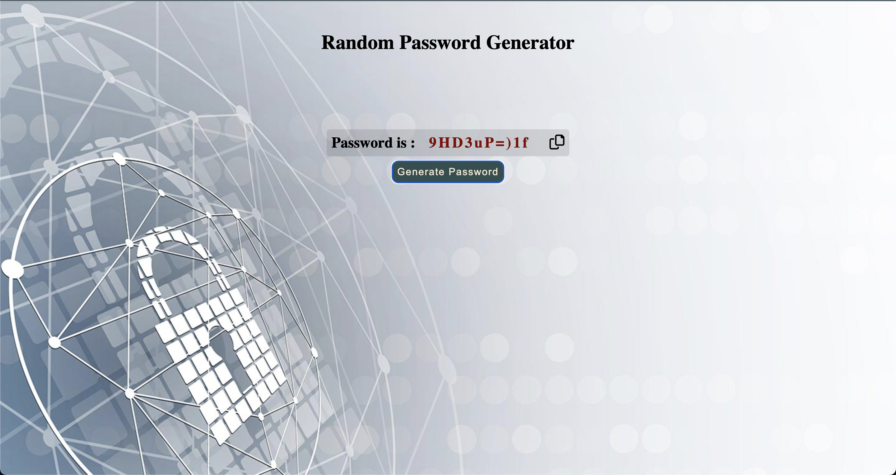

# Random-Password-Generator

## Description

Built a page to generate a random password containing numbers, symbols, lowercase and uppercase characters.

### Topics are to be covered;

- HTML, CSS, JS, DOM Manipulation.

## Expected Outcome
**

**

**
&#9786; Happy Coding &#9997;
**
